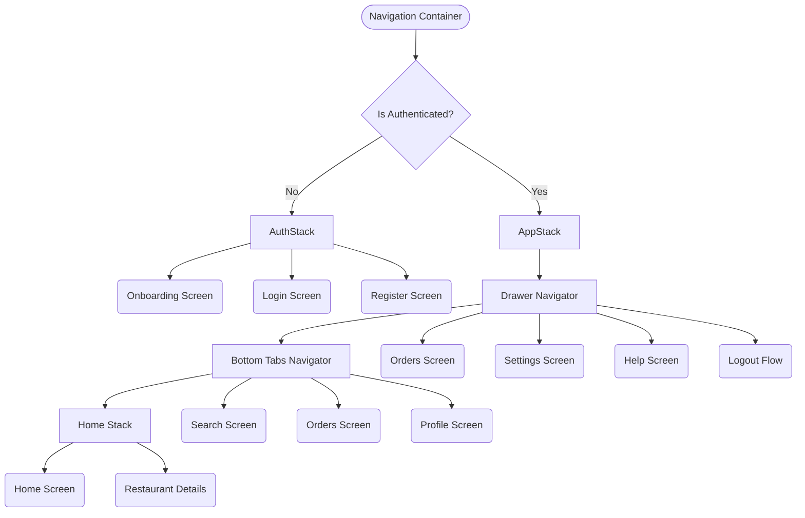

# Food Delivery App

A comprehensive Food Delivery mobile application built with React Native and Expo, showcasing advanced navigation architectures, a robust design system, and persistent authentication.

## 🚀 Navigation Architecture

The application uses nested navigators to provide a fluid, standard mobile app experience. We utilize Stack, Drawer, and Bottom Tab navigators from `react-navigation`.



## 🔗 Deep Linking

The app supports deep linking using the `foodapp://` and `fooddeliveryapp://` schemes.

**Supported Routes:**
- `foodapp://home` - Navigate directly to the Home screen
- `foodapp://restaurant/123` - Navigate directly to a specific restaurant's details page
- `foodapp://orders` - Navigate directly to the orders screen

To test deep linking in the simulator, you can run:
```bash
npx uri-scheme open foodapp://restaurant/123 --ios
```

## 📦 Project Setup

1. **Install dependencies:**
   ```bash
   npm install
   ```

2. **Run the Expo development server:**
   ```bash
   npx expo start
   ```

3. **Open the app:**
   - Scan the QR code with the Expo Go app on your physical device.
   - Or press `a` to open in the Android emulator.
   - Or press `i` to open in the iOS simulator.

## ✨ Features

- **Nested Navigation:** Complex but seamless routing using React Navigation (Stack, Drawer, Tabs).
- **Persistent Authentication:** Uses `AsyncStorage` to maintain user session state across app reloads.
- **Programmatic Navigation:** Implements `navigate`, `goBack`, `replace`, and `reset` methods for precise flow control.
- **Dynamic Theming:** Built-in Light and Dark modes.
- **Cart & Orders Context:** Centralized state management for a fully functional shopping cart.
